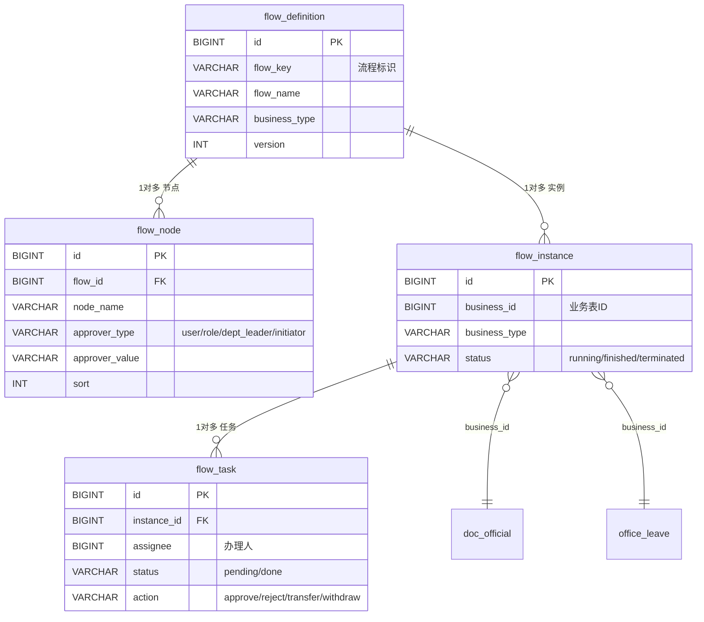

# 流程设计总览

> 协同办公平台所有审批/业务流程清单。流程统一基于引擎 `flow_definition → flow_node → flow_instance → flow_task`，
> 业务通过 `FlowCompletedEvent` 事件解耦回写自身状态。
> 
> 本文档对应功能开发清单中「是否含流程 = 是」的 9 个功能，共 9 份流程设计文档。

## 一、流程清单

| 序号 | 流程 | flow_key | business_type | 所属模块 | 难度 | 优先级 | 阶段 | 所属端 | 涉及数据库表 | 文档 |
|---|---|---|---|---|---|---|---|---|---|---|
| 01 | 信息发布审核流程 | `article_publish` | article | ② 信息发布 | 中等 | P0 | 一期 | PC/移动 | portal_article,portal_column,portal_article_file,portal_read_record | [01-信息发布审核流程.md](01-信息发布审核流程.md) |
| 02 | 发文审批流程 | `document_send` | document_send | ④ 公文管理 | 复杂 | P0 | 一期 | PC/移动 | doc_official,doc_send_template,doc_opinion,flow_* | [02-发文审批流程.md](02-发文审批流程.md) |
| 03 | 收文办理流程 | `document_receive` | document_receive | ④ 公文管理 | 复杂 | P0 | 一期 | PC/移动 | doc_official,doc_receive_register,flow_* | [03-收文办理流程.md](03-收文办理流程.md) |
| 04 | 请休假审批流程 | `leave` | leave | ⑥ 综合办公 | 中等 | P0 | 一期 | PC/移动 | office_leave,sys_dict_data,flow_* | [04-请休假审批流程.md](04-请休假审批流程.md) |
| 05 | 用车审批流程 | `vehicle` | vehicle | ⑥ 综合办公 | 中等 | P0 | 一期 | PC/移动 | office_vehicle,office_car,office_car_record,flow_* | [05-用车审批流程.md](05-用车审批流程.md) |
| 06 | 用印审批流程 | `seal` | seal | ⑥ 综合办公 | 中等 | P0 | 一期 | PC/移动 | office_seal,office_seal_registry,office_seal_record,flow_* | [06-用印审批流程.md](06-用印审批流程.md) |
| 07 | 出差审批流程 | `trip` | trip | ⑥ 综合办公 | 中等 | P0 | 一期 | PC/移动 | office_trip,flow_* | [07-出差审批流程.md](07-出差审批流程.md) |
| 08 | 资产领用流程 | `asset` | asset | ⑥ 综合办公 | 复杂 | P1 | 二期 | PC/移动 | office_asset,office_asset_apply,office_asset_record,flow_* | [08-资产领用流程.md](08-资产领用流程.md) |
| 09 | 办公用品申请流程 | `supply` | supply | ⑥ 综合办公 | 中等 | P1 | 二期 | PC/移动 | office_supply,office_supply_stock,office_supply_apply,flow_* | [09-办公用品申请流程.md](09-办公用品申请流程.md) |

> 公文交换（⑤，P2/三期）的流程扩展见 [02-发文审批流程.md § 九](02-发文审批流程.md)，不单独建流程文档。

## 二、流程引擎模型



## 三、办理人解析规则（`flow_node.approver_type`）

| approver_type | 解析逻辑 |
|---|---|
| `user` | 直接指定用户（`approver_value` = 用户ID） |
| `role` | 按角色查所有拥有该角色的用户（`approver_value` = role_key） |
| `dept_leader` | 取发起人所在部门的主管（动态解析） |
| `initiator` | 发起人本人（常用于会签补签或确认节点） |

## 四、通用流程操作

| 操作 | 触发方 | 引擎行为 |
|---|---|---|
| 提交（发起） | 发起人 | 创建 `flow_instance` + 首节点 `flow_task` |
| 通过 | 当前待办人 | 当前 task done，流转到下一节点；末节点则实例 finished，发布 `FlowCompletedEvent` |
| 驳回（退办） | 当前待办人 | 退回上一节点或发起人，记意见 |
| 撤办 | 发起人 | 审批中且未办理时可撤回，实例 terminated |
| 催办 | 发起人 | 给当前待办人发催办消息 |
| 转办 | 当前待办人 | 委托他人（`flow_delegation`），变更 `assignee` 并留痕 |

## 五、业务回写机制

各业务表通过监听 `FlowCompletedEvent`（`business_type` + `business_id`）回写自身状态：

```
审批通过(末节点) → flow_instance.status=finished
                → 发布 FlowCompletedEvent
                → 各业务监听器：
                    article         → portal_article.status=2 + publish_time
                    document_send   → doc_official.status=2 + 生成文号 + 归档
                    document_receive→ doc_official.status=3 + 归档
                    leave           → office_leave.status=2 + 扣减年假
                    vehicle         → office_vehicle.status=4 + 释放车辆
                    seal            → office_seal.status=4 + 写用印台账 office_seal_record
                    trip            → office_trip.status=2 + 考勤公出
                    asset           → office_asset_apply.status=2 + 写变动记录
                    supply          → office_supply_apply.status=4 + 扣减库存
```

## 六、流程设计规范

1. 每个流程有唯一 `flow_key`（小写下划线），与 `business_type` 一一对应。
2. 节点 `sort` 决定串行顺序；会签节点为并行，全部通过才流转。
3. 条件分支（如按金额/天数决定审批层级）由业务层在流转时判断跳转。
4. 所有审批意见写入对应业务意见表（`doc_opinion` / `flow_task.comment`），可追溯。
5. 委托授权（`flow_delegation`）生效期间，待办任务的办理人自动解析为被授权人。
