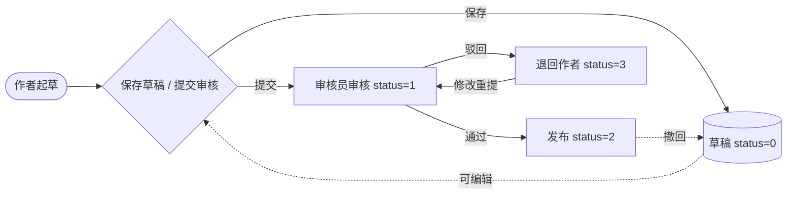

# 信息发布审核流程

> 流程标识：`flow_key = article_publish`，`business_type = article`
> 适用模块：② 信息发布
> 关联表：`portal_article`、`portal_column`、`portal_article_file`、`portal_read_record`
> 优先级：**P0** | 阶段：**一期** | 所属端：**PC/移动** | 状态：未开始
> 难度：中等 | 涉及数据库表见功能开发清单序号 2

## 一、流程概述

信息发布底座能力：作者撰写文章 → 提交审核 → 审核通过后发布（或驳回退回作者）。
发布后支持置顶、查看权限、阅读时效、下载次数/人员统计。

## 二、适用范围

- 各栏目信息文章（通知类、新闻类、制度类等）
- 需要审核才能对外发布的内容

## 三、参与角色

| 角色 | 说明 |
|---|---|
| 作者/拟稿人 | 撰写文章、提交审核、修改后重提 |
| 栏目审核员 | 审核文章，通过或驳回（可填写审核意见） |
| 发布管理员（可选） | 多级栏目可加二审/终审 |

## 四、流程节点与流转



## 五、状态机（`portal_article.status`）

| 状态值 | 含义 | 可流转至 |
|---|---|---|
| 0 | 草稿 | 1（提交审核） |
| 1 | 待审核 | 2（通过）/ 3（驳回） |
| 2 | 已发布 | 0（撤回，回到草稿） |
| 3 | 驳回 | 1（修改后重新提交） |

## 六、关键业务规则

1. **阅读时效**：`read_expire` 非空时，超过该时间后对普通用户不可见（管理员仍可见）。
2. **查看权限**：`visible_scope` 控制可见范围（角色/部门/人员）；空表示全员可见。
3. **置顶**：`top=1` 在栏目列表置顶，同栏目多置顶按 `publish_time` 倒序。
4. **下载统计**：每次下载写 `portal_article_download`（按人记录）并累加 `portal_article_file.download_count`。
5. **审核意见**：驳回需填写 `audit_comment`，作者可在「我的草稿」查看驳回原因。
6. **阅读记录**：用户打开已发布文章时写 `portal_read_record`（`article_id + user_id` 唯一，按人去重），并累加 `portal_article.view_count`。

## 七、流程事件与业务回写

- 提交审核走统一流程引擎：创建 `flow_instance`（`flow_key=article_publish`，`business_type=article`）+ 审核员 `flow_task`，审核员在「待办事项」中通过/驳回。
- 多级栏目需二审/终审时，在 `flow_node` 增加审核节点即可，业务代码不变。

```text
FlowCompletedEvent(business_type=article, business_id=portal_article.id)
  └─> 监听器：portal_article.status=2, publish_time=NOW(), publish_user_id
        └─> 按栏目可见范围发站内消息(sys_message)
```

- 驳回不走办结事件：当前节点 `flow_task` 置 `reject`，退回发起人，`portal_article.status=3` 并写 `audit_comment`。

## 八、异常与分支

- **撤回**：已发布文章发布者可撤回，回到草稿，已产生的阅读记录保留。
- **重复提交**：草稿被驳回后再次提交，覆盖原 `audit_comment`，重新进入待审。

