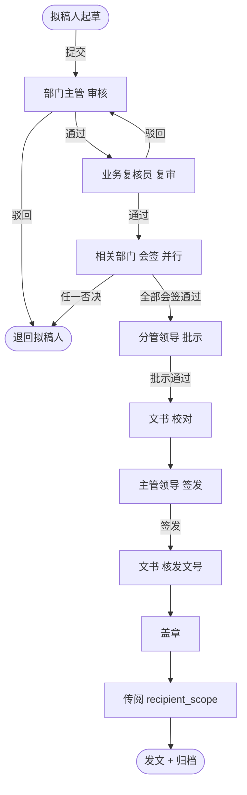

# 发文审批流程

> 流程标识：`flow_key = document_send`，`business_type = document_send`
> 适用模块：④ 公文管理 · 发文管理
> 关联表：`doc_official`、`doc_send_template`、`doc_opinion`、`flow_*`
> 优先级：**P0** | 阶段：**一期** | 所属端：**PC/移动** | 状态：未开始
> 难度：复杂 | 含会签并行节点，最长流程 | 涉及数据库表见功能开发清单序号 4

## 一、流程概述

发文管理实现多环节公文流转：拟稿 → 审核 → 复审 → 会签 → 批示 → 校对 → 签发 → 核发文号 → 盖章 → 传阅 → 发文（归档）。
是本系统最长的审批流程，含**并行会签**节点。

## 二、适用范围

- 各类上行文、下行文、平行文的发文办理
- 通过发文模板（`doc_send_template`）快速起草

## 三、参与角色

| 角色 | 节点 | approver_type |
|---|---|---|
| 拟稿人 | 拟稿（发起） | initiator |
| 部门主管 | 审核 | dept_leader |
| 业务复核员 | 复审 | role |
| 相关部门负责人 | 会签（并行） | role/user（多选） |
| 分管领导 | 批示 | role |
| 文书 | 校对 / 核发文号 / 盖章 | role |
| 主管领导 | 签发 | role |

## 四、流程节点与流转



## 五、状态机（`doc_official.status`，`doc_type=send`）

| 状态值 | 含义 | 可流转至 |
|---|---|---|
| 0 | 草稿 | 1（提交审批） |
| 1 | 审批中 | 2（签发完成发布）/ 3（驳回） |
| 2 | 已发布 | —（进入归档） |
| 3 | 驳回 | 1（修改后重新提交） |

> 归档标记：`archived=1` 由发文完成后置位，归档后不可编辑正文。

## 六、关键业务规则

1. **文号生成**：签发后由 `doc_no_rule` 按「文种 + 年度 + 部门 + 流水」自动生成 `doc_no`，分配后即占用流水号（`year_seq+1`），不可回退。
2. **会签并行**：会签节点为并行审批，所有会签人**全部同意**才向下流转；任一否决则整体驳回。
3. **意见留痕**：每个审批环节写一条 `doc_opinion`（含 `node_name`、`opinion_type`、`content`），可引用 `sys_opinion_phrase` 常用语。
4. **紧急程度**：`urgency` 为紧急/特急时，会签节点可跳过复审直接进入批示。
5. **密级控制**：`secrecy` 为秘密/机密时，传阅范围（`recipient_scope`）严格限定，访问需二次鉴权。

## 七、流程事件与业务回写

```text
FlowCompletedEvent(business_type=document_send, business_id=doc_official.id)
  └─> 监听器：doc_official.status=2, publish_date=今日, archived=1
        └─> 触发文号生成（如未生成）
              └─> 给传阅范围人员发站内消息(sys_message)
```

## 八、异常与分支

| 操作 | 触发方 | 行为 |
|---|---|---|
| 退办（驳回） | 当前审批人 | 退回上一节点或发起人，记 `doc_opinion` |
| 撤办 | 发起人 | 审批中且下一节点未办理时可撤回，回到草稿 |
| 催办 | 发起人 | 给当前待办人发催办消息，记 `flow_task.remark` |
| 转办 | 当前待办人 | 委托他人办理（见 `flow_delegation`），任务 `assignee` 变更并留痕 |

## 九、公文交换扩展

发文完成并归档后，若需发往**外部单位**，由「公文交换」发起 `doc_exchange` 记录，
对方单位接收后写 `doc_exchange_log`（send→receive→read→reconcile），完成对账。
详见报价清单 ⑤ 公文交换。

