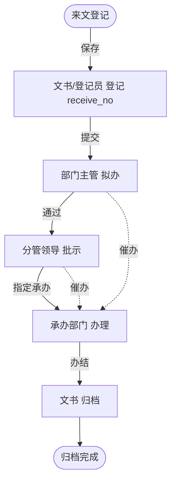

# 收文办理流程

> 流程标识：`flow_key = document_receive`，`business_type = document_receive`
> 适用模块：④ 公文管理 · 收文管理
> 关联表：`doc_official`、`doc_receive_register`、`flow_*`
> 优先级：**P0** | 阶段：**一期** | 所属端：**PC/移动** | 状态：未开始
> 难度：复杂 | 涉及数据库表见功能开发清单（公文管理·收文管理）

## 一、流程概述

收文管理实现来文的**登记 → 传递 → 审批 → 发送 → 催办 → 归档**全流程电子化管理。
对应报价清单「收文主要是指单位收文，实现来文的登记、传递、审批、发送、催办和归档等全流程」。

## 二、适用范围

- 外部来文（上级单位、平级单位、下属单位）的接收办理
- 内部流转的收文

## 三、参与角色

| 角色 | 节点 | 说明 |
|---|---|---|
| 收文登记员 | 登记 | 录入来文信息，分配收文编号 |
| 部门主管 | 拟办意见 | 提出办理建议 |
| 分管领导 | 批示 | 指定承办部门/人员 |
| 承办人 | 办理 | 落实文件要求，反馈办理结果 |
| 文书 | 归档 | 办理完毕归档 |

## 四、流程节点与流转



## 五、状态机（`doc_official.status`，`doc_type=receive`）

| 状态值 | 含义 | 可流转至 |
|---|---|---|
| 1 | 已登记 | 2（进入办理） |
| 2 | 办理中 | 3（归档）/ 2（退回重办） |
| 3 | 已归档 | —（终态） |

## 六、关键业务规则

1. **收文编号**：登记时由系统按「年度 + 收文流水」生成 `doc_receive_register.receive_no`。
2. **来文信息**：`from_unit`（来文单位）、`from_doc_no`（来文文号）、`receive_date` 必填。
3. **传递去向**：`transfer_to` 记录文件流转的部门/人员轨迹。
4. **催办**：`doc_receive_register.urge_count` 累计催办次数，`last_urge_time` 记录最近催办时间，催办给承办人发消息。
5. **归档**：`archived=1` 后收文进入只读，不可再办。

## 七、流程事件与业务回写

```text
FlowCompletedEvent(business_type=document_receive, business_id=doc_official.id)
  └─> 监听器：doc_official.status=3, archived=1
        └─> doc_receive_register 更新办结信息
```

## 八、异常与分支

- **退办重办**：承办人无法办理可退回批示节点，重新指定承办。
- **催办**：拟办/批示节点均可对当前承办人发起催办。
- **多人承办**：批示可指定多个承办部门并行办理，全部办结才归档。

## 九、与公文交换的关系

收文的来文来源若来自「公文交换」，则 `doc_receive_register` 由 `doc_exchange`
接收动作自动触发登记，`from_unit`/`from_doc_no` 取自交换记录。


