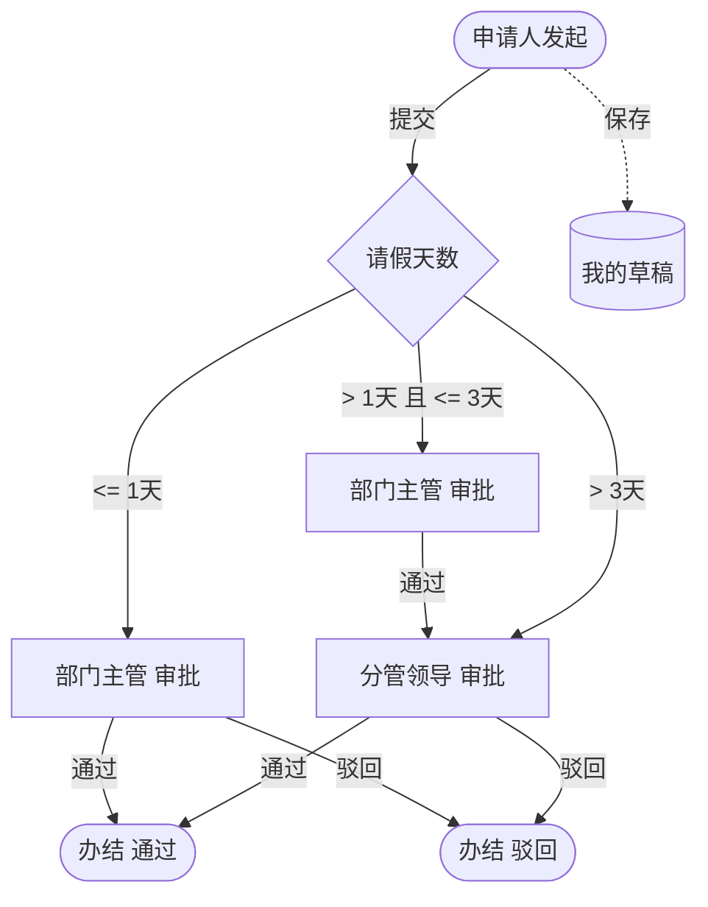

# 请休假审批流程

> 流程标识：`flow_key = leave`，`business_type = leave`
> 适用模块：⑥ 综合办公 · 请休假管理
> 关联表：`office_leave`、`sys_dict_data`、`flow_*`
> 优先级：**P0** | 阶段：**一期** | 所属端：**PC/移动** | 状态：未开始
> 难度：中等 | 假别由字典 oa_leave_type 维护 | 涉及数据库表见功能开发清单（综合办公·请休假管理）

## 一、流程概述

支持请休假信息的网上申请、审批操作，包括外事假、年假、调休等假期管理；用户可自行设置假别，灵活便捷。

## 二、适用范围

- 全员请休假申请（事假、病假、年假、调休、婚假、产假、外事假等）
- 假别由字典 `oa_leave_type` 维护，可自定义扩展

## 三、参与角色

| 角色 | 节点 | approver_type |
|---|---|---|
| 申请人 | 发起（起草） | initiator |
| 部门主管 | 一级审批 | dept_leader |
| 分管领导 | 二级审批（请假天数 ≥ 阈值时） | role |
| HR | 备案（可选） | role |

## 四、流程节点与流转



## 五、状态机（`office_leave.status`）

| 状态值 | 含义 | 可流转至 |
|---|---|---|
| 0 | 草稿 | 1（提交审批） |
| 1 | 审批中 | 2（通过）/ 3（驳回） |
| 2 | 通过 | —（终态） |
| 3 | 驳回 | 1（修改重提） |

## 六、关键业务规则

1. **天数计算**：`days = end_date - start_date`（含首尾），支持半天（`DECIMAL(6,1)`）。
2. **假别校验**：`leave_type` 必须为有效字典值；年假需校验剩余年假额度（可扩展 `office_leave_balance`）。
3. **代理人**：`proxy_user_id` 必填或选填（看制度），用于休假期间工作交接。
4. **审批层级**：按请假天数动态决定审批层级（流程引擎按条件分支跳转节点）。
5. **节假日剔除**：计算天数时可结合 `office_holiday` 剔除法定休息日（按制度配置）。

## 七、流程事件与业务回写

```text
FlowCompletedEvent(business_type=leave, business_id=office_leave.id)
  └─> 监听器：office_leave.status=2
        └─> （扩展）扣减年假余额 / 写考勤异常标记
```

## 八、异常与分支

- **销假**：申请人提前回岗可发起「销假」，调整实际休假天数。
- **转办**：审批人休假可委托他人审批（`flow_delegation`）。
- **撤回**：审批中且未被处理时，申请人可撤回修改。


