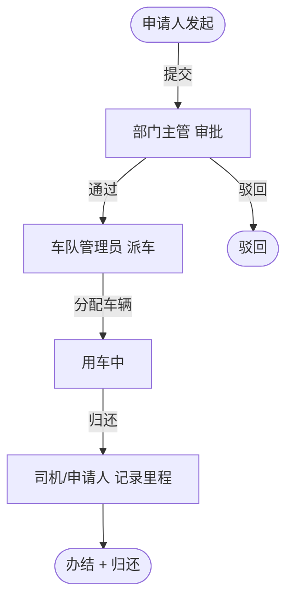

# 用车审批流程

> 流程标识：`flow_key = vehicle`，`business_type = vehicle`
> 适用模块：⑥ 综合办公 · 用车流程
> 关联表：`office_vehicle`、`office_car`、`office_car_record`、`flow_*`
> 优先级：**P0** | 阶段：**一期** | 所属端：**PC/移动** | 状态：未开始
> 难度：中等 | 涉及数据库表见功能开发清单（综合办公·用车流程）

## 一、流程概述

建立车辆的申请、使用管理，车辆状态管理与汇总分析，帮助企业完善用车体系的系统化管理。

## 二、适用范围

- 因公用车申请（市内公务、外出办事、接待等）
- 车辆资源调度与状态管理

## 三、参与角色

| 角色 | 节点 | 说明 |
|---|---|---|
| 申请人 | 发起用车 | 填写用车时间、起止地点、车型 |
| 部门主管 | 审批 | 审核用车必要性 |
| 车队管理员 | 派车 | 分配车辆（`office_car`）、司机 |
| 司机/申请人 | 用车 + 归还 | 记录里程、归还车辆 |

## 四、流程节点与流转



## 五、状态机（`office_vehicle.status`）

| 状态值 | 含义 |
|---|---|
| 0 | 草稿 |
| 1 | 审批中 |
| 2 | 通过（待派车） |
| 3 | 驳回 |
| 4 | 已归还（办结） |

## 六、关键业务规则

1. **车辆占用**：派车时校验 `office_car` 在用车时段是否空闲（`status=0 空闲`），占用后置 `status=1 使用中`。
2. **车型偏好**：`car_type` 由字典 `oa_vehicle_type`（轿车/商务车/客车）约束。
3. **里程记录**：归还时记录 `office_car_record.mileage_out`/`mileage_in`，用于车辆使用汇总分析。
4. **乘车人数**：`passengers` 用于匹配车辆座位数（`office_car.seats`）。

## 七、流程事件与业务回写

```text
FlowCompletedEvent(business_type=vehicle, business_id=office_vehicle.id)
  └─> 监听器：office_vehicle.status=4
        └─> office_car.status=0（释放车辆空闲）
        └─> 写 office_car_record（里程/时间）
```

## 八、异常与分支

- **取消用车**：审批通过后未实际用车可取消，释放车辆。
- **延期归还**：归还时间超过申请时间，登记超时并提示。
- **车辆维修**：车辆 `status=2 维修` 时不可派车。

