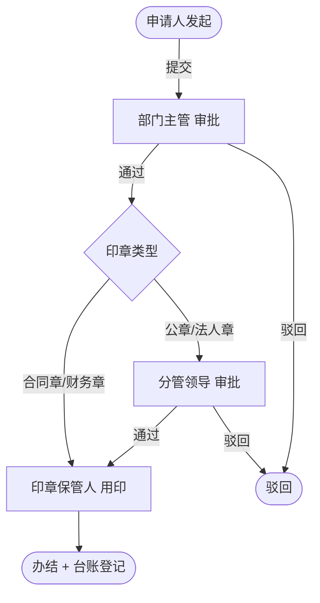

# 用印审批流程

> 流程标识：`flow_key = seal`，`business_type = seal`
> 适用模块：⑥ 综合办公 · 用印流程
> 关联表：`office_seal`、`office_seal_registry`、`office_seal_record`、`flow_*`
> 优先级：**P0** | 阶段：**一期** | 所属端：**PC/移动** | 状态：未开始
> 难度：中等 | 涉及数据库表见功能开发清单（综合办公·用印流程）

## 一、流程概述

支持用印的申请、审批，规范印章使用，留存用印记录台账。

## 二、适用范围

- 公章、合同章、财务章、法人章等各类型印章使用申请
- 涉及合同签订、对外文件、证照办理等需盖章事项

## 三、参与角色

| 角色 | 节点 | 说明 |
|---|---|---|
| 申请人 | 发起用印 | 选印章类型、事项类型、份数、用途 |
| 部门主管 | 审批 | 审核用印必要性 |
| 分管领导 | 审批（重要印章） | 公章/法人章等需领导审批 |
| 印章保管人 | 用印登记 | 实际盖章并登记台账 |

## 四、流程节点与流转



## 五、状态机（`office_seal.status`）

| 状态值 | 含义 |
|---|---|
| 0 | 草稿 |
| 1 | 审批中 |
| 2 | 通过（待用印） |
| 3 | 驳回 |
| 4 | 已用印（办结） |

## 六、关键业务规则

1. **印章类型**：`seal_type` 由字典 `oa_seal_type`（公章/合同章/财务章/法人章）约束，决定审批层级。
2. **份数控制**：`file_count` 记录盖章份数，保管人核对一致后方可放行。
3. **用途说明**：`usage_desc` 必填，明确用印事由，便于追溯。
4. **台账留痕**：每次实际用印写一条 `office_seal_record`（印章 + 申请单 + 保管人 + 份数 + 时间），形成用印台账；`office_seal_registry` 仅作印章主数据（一印一行），不承载台账。
5. **印章状态**：`office_seal_registry.status` 为停用/销毁时不可申请该印章。

## 七、流程事件与业务回写

```text
FlowCompletedEvent(business_type=seal, business_id=office_seal.id)
  └─> 监听器：office_seal.status=4
        └─> 写 office_seal_record 用印台账（保管人/份数/时间）
```

## 八、异常与分支

- **拒印**：保管人发现实际事项与申请不符可拒印，流程退回。
- **补印**：同一事项需追加份数可发起补印申请。


