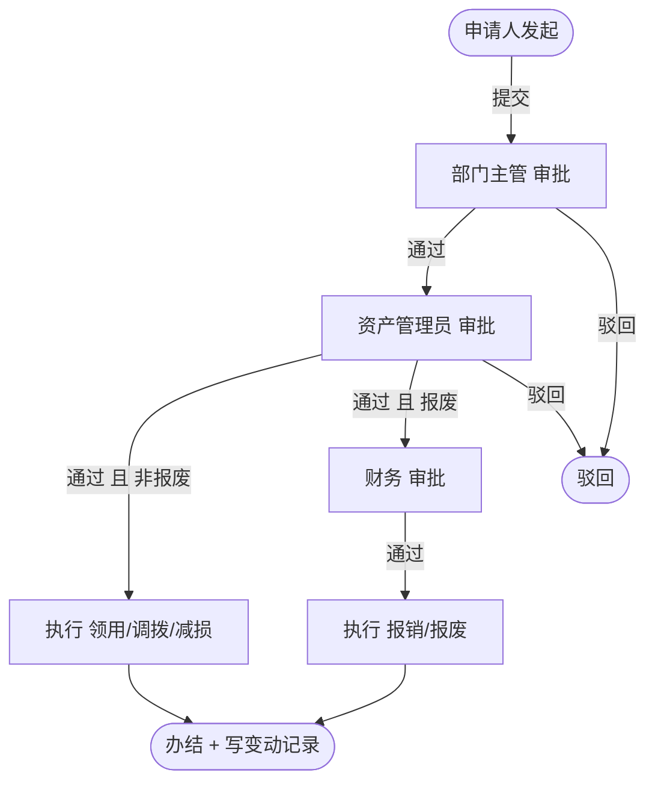

# 资产领用流程

> 流程标识：`flow_key = asset`，`business_type = asset`
> 适用模块：⑥ 综合办公 · 资产管理
> 关联表：`office_asset`、`office_asset_apply`、`office_asset_record`、`flow_*`
> 优先级：**P1** | 阶段：**二期** | 所属端：**PC/移动** | 状态：未开始
> 难度：复杂 | 含领用/调拨/减损/报废四种子类型 | 涉及数据库表见功能开发清单（综合办公·资产管理）

## 一、流程概述

建立企业办公类资产的申请、领用、调拨、减损、报废以及汇总统计的整个资产生命周期管理。
本流程覆盖资产领用/调拨/减损/报废的审批与执行。

## 二、适用范围

- 资产领用（员工申领办公设备/家具）
- 资产调拨（跨部门转移）
- 资产减损（盘亏/损坏）
- 资产报废（生命周期终结）

## 三、参与角色

| 角色 | 节点 | 说明 |
|---|---|---|
| 申请人 | 发起申请 | 选申请类型、资产、数量、理由 |
| 部门主管 | 审批 | 审核申请合理性 |
| 资产管理员 | 审批 + 执行 | 库存/在用核对，办理出入库 |
| 财务（报废时） | 审批 | 报废资产需财务核准 |

## 四、流程节点与流转



## 五、状态机（`office_asset_apply.status`）

| 状态值 | 含义 |
|---|---|
| 0 | 草稿 |
| 1 | 审批中 |
| 2 | 通过 |
| 3 | 驳回 |

资产主数据 `office_asset.status`：0闲置 / 1在用 / 2维修 / 3报废。

## 六、关键业务规则

1. **申请类型**：`apply_type` 为 requisition领用 / transfer调拨 / reduce减损 / scrap报废，决定后续节点。
2. **库存校验**：领用前校验资产可用数量（闲置状态），不足则驳回。
3. **变动留痕**：每次办结写一条 `office_asset_record`（action + 变更前后归属），保证资产全生命周期可追溯。
4. **归属变更**：领用/调拨办结时更新 `office_asset.use_dept_id`、`use_user_id`。
5. **报废减损**：报废置 `office_asset.status=3`，减损调整 `depreciation` 累计值。

## 七、流程事件与业务回写

```text
FlowCompletedEvent(business_type=asset, business_id=office_asset_apply.id)
  └─> 监听器：
      ├─ office_asset_apply.status=2
      ├─ 按 apply_type 更新 office_asset 归属/状态/减损
      └─ 写 office_asset_record（全生命周期留痕）
```

## 八、异常与分支

- **调拨争议**：跨部门调拨需双方部门主管确认（可加会签节点）。
- **报废残值**：报废资产如有残值回收，财务在审批环节登记。
- **批量操作**：支持批量领用/调拨（一次申请多条资产明细）。

