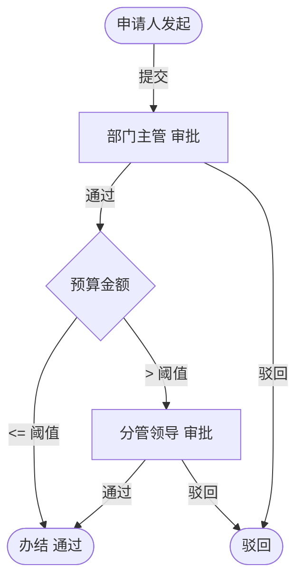

> 本文档仅作为业务流程参考。
> 功能范围以 docs/功能开发清单.xlsx 为准。
> 技术架构以 docs/ARCHITECTURE.md 为准。
> 表名、字段、状态值、流程引擎实现和审批节点均需在对应工作包中重新确认，
> 不得直接视为新系统最终设计。

# 出差审批流程

> 流程标识：`flow_key = trip`，`business_type = trip`
> 适用模块：⑥ 综合办公 · 出差管理
> 关联表：`office_trip`、`flow_*`
> 优先级：**P0** | 阶段：**一期** | 所属端：**PC/移动** | 状态：未开始
> 难度：中等 | 涉及数据库表见功能开发清单（综合办公·出差管理）

## 一、流程概述

出差申请与审批管理，覆盖出差申请、预算预估、审批、销差报销衔接。

## 二、适用范围

- 员工因公出差（会议、拜访、项目驻场等）
- 含交通方式、预算预估

## 三、参与角色

| 角色 | 节点 | 说明 |
|---|---|---|
| 申请人 | 发起出差 | 填目的地、时间、交通、预算 |
| 部门主管 | 一级审批 | 审核出差必要性 |
| 分管领导 | 二级审批（预算超阈值） | 大额预算需领导审批 |
| 财务 | 备案（可选） | 预算备案 |

## 四、流程节点与流转



## 五、状态机（`office_trip.status`）

| 状态值 | 含义 |
|---|---|
| 0 | 草稿 |
| 1 | 审批中 |
| 2 | 通过 |
| 3 | 驳回 |
| 4 | 已报销（销差完成） |

## 六、关键业务规则

1. **天数计算**：`days = end_date - start_date`（含首尾）。
2. **交通方式**：`travel_mode` 由字典 `oa_travel_mode`（飞机/高铁/火车/汽车）约束，影响预算标准。
3. **预算预估**：`budget` 由申请人预估，超阈值（如 5000 元）触发二级审批。
4. **销差报销**：出差结束后发起报销（`status=4`），与财务系统衔接（预留接口）。
5. **考勤联动**：出差期间考勤标记为「公出」，不影响出勤统计（`office_att_rule.trip_rule`）。

## 七、流程事件与业务回写

```text
FlowCompletedEvent(business_type=trip, business_id=office_trip.id)
  └─> 监听器：office_trip.status=2
        └─> 出差期间写考勤「公出」标记
```

## 八、异常与分支

- **变更行程**：审批通过后变更目的地/时间需重新审批。
- **提前回程**：实际天数少于申请天数，销差时据实调整。
