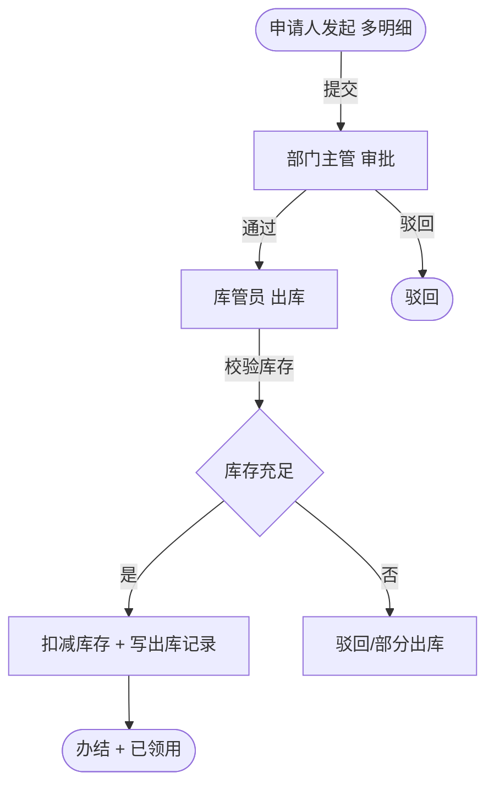

> 本文档仅作为业务流程参考。
> 功能范围以 docs/功能开发清单.xlsx 为准。
> 技术架构以 docs/ARCHITECTURE.md 为准。
> 表名、字段、状态值、流程引擎实现和审批节点均需在对应工作包中重新确认，
> 不得直接视为新系统最终设计。

# 办公用品申请流程

> 流程标识：`flow_key = supply`，`business_type = supply`
> 适用模块：⑥ 综合办公 · 办公用品管理
> 关联表：`office_supply`、`office_supply_stock`、`office_supply_apply`、`flow_*`
> 优先级：**P1** | 阶段：**二期** | 所属端：**PC/移动** | 状态：未开始
> 难度：中等 | 涉及数据库表见功能开发清单（综合办公·办公用品管理）

## 一、流程概述

支持办公用品库存管理、出入库记录、办公用品申请、申请记录。
本流程覆盖员工办公用品申领的审批与出库。

## 二、适用范围

- 员工日常办公用品申领（纸笔、文件夹、耗材等）
- 库存预警与出入库管理

## 三、参与角色

| 角色 | 节点 | 说明 |
|---|---|---|
| 申请人 | 发起申领 | 选用品、数量（可多选） |
| 部门主管 | 审批 | 审核申领合理性 |
| 库管员 | 出库 | 校验库存、办理出库 |

## 四、流程节点与流转



## 五、状态机（`office_supply_apply.status`）

| 状态值 | 含义 |
|---|---|
| 0 | 草稿 |
| 1 | 审批中 |
| 2 | 通过（待出库） |
| 3 | 驳回 |
| 4 | 已领用（办结） |

## 六、关键业务规则

1. **申领明细**：`items_json` 存储明细列表 `[{supplyId, qty}]`，支持一次申请多种用品。
2. **库存校验**：出库时逐项校验 `office_supply.stock` 是否 ≥ 申领数量。
3. **库存预警**：出库后若 `stock < warning_stock` 触发库存预警，提醒采购补货。
4. **出入库记录**：每次出库写 `office_supply_stock`（`stock_type=out`），记录变更前后库存。
5. **部分出库**：库存不足时可选择部分出库或整单驳回。

## 七、流程事件与业务回写

```text
FlowCompletedEvent(business_type=supply, business_id=office_supply_apply.id)
  └─> 监听器：office_supply_apply.status=4
        ├─ 遍历 items_json 扣减 office_supply.stock
        ├─ 写 office_supply_stock（出库记录）
        └─ 触发库存预警检查
```

## 八、异常与分支

- **入库管理**：采购入库由库管员直接操作（`office_supply_stock.stock_type=in`），不走审批流。
- **退库**：领用后未使用可退库，反向增加库存。
- **限量控制**：可配置每人/每部门月度申领上限（扩展规则表）。

## 九、与出入库管理的关系

办公用品管理的「库存管理 + 出入库记录」是底座能力（非流程），
「申请审批 + 出库」是流程能力，二者通过 `office_supply_apply` 与 `office_supply_stock` 关联。
