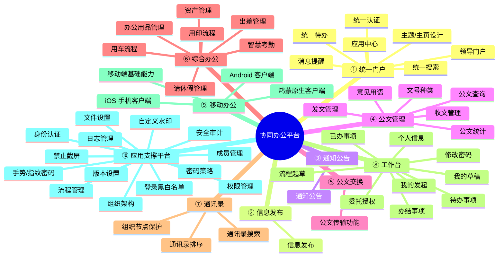
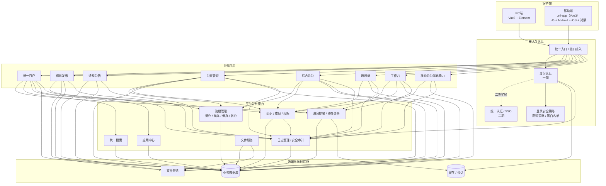

# 协同办公平台 · 系统导图

> 基于《功能开发清单.xlsx》，覆盖 10 大模块、53 个二级功能，预估 505 人日。
> 难易度分布：简单 15（28.3%）/ 中等 24（45.3%）/ 复杂 14（26.4%）
> 可用支持 Mermaid 的 Markdown 查看器（如 Typora / VS Code + Mermaid 插件 / GitHub）渲染下图。

> 当前范围说明：本版重点校验并展开一期、二期；三期功能仅保留清单映射，不纳入当前架构设计与交付重点。

## 一、功能导图（Mermaid mindmap）



## 二、系统架构导图（一期/二期，Mermaid graph）

> 下图只表达《功能开发清单》能够确认的一期、二期能力边界。数据库类型、后端框架版本、对象存储产品等技术选型需在技术方案中另行确认。



### 关键功能边界

- **身份认证（一期）与统一认证（二期）**：身份认证是平台内部账号、登录和认证方式的基础能力；统一认证是在此基础上实现跨系统 SSO、短信/二维码等扩展登录与令牌交换。
- **消息提醒、统一待办与工作台待办事项**：消息提醒负责通知触达；统一待办负责接入并聚合外部应用待办；工作台待办事项负责向当前用户展示和办理待办。
- **信息发布与通知公告**：信息发布包含栏目、文章、附件、阅读时效及审核流程；通知公告偏向快速发布、撤回、置顶和阅读反馈统计，两者不应在架构中合并为同一功能。
- **支撑平台不是业务数据访问中转层**：权限、组织、流程、日志、文件等是被业务模块复用的公共能力；各业务模块仍直接维护自身业务数据。

## 三、功能树（文本结构）

```
协同办公平台
├── 统一门户
│   ├── 主题/主页设计 ……… 设计开发门户主题与首页，为单位所有用户提供各类事项的发起与信息查询服务入口
       [难度:中等 | P0 | 一期 | PC/移动 | 未开始 | 含统计卡片/最近公告/待办/快捷导航]
│   ├── 统一认证 ……… 支持一处登录接入所有应用系统，支持短信、密码、二维码等多种登录方式
       [难度:复杂 | P1 | 二期 | PC/移动 | 未开始 | SSO 单点登录需对接，二维码登录需 token 交换]
│   ├── 消息提醒 ……… 待办、新闻等消息提醒（站内 + 待办聚合）
       [难度:简单 | P0 | 一期 | PC/移动 | 未开始 | WebSocket/轮询可选]
│   ├── 应用中心 ……… 所有应用统一入口，支持接入应用的创建/分类/下线/分级权限/搜索
       [难度:中等 | P1 | 二期 | PC | 未开始 | 应用注册表 + 角色可见范围]
│   ├── 统一待办 ……… 提供标准接口，集成用户各应用系统待办
       [难度:中等 | P1 | 二期 | PC/移动 | 未开始 | 需对外标准 API + 适配器]
│   ├── 统一搜索 ……… 支持联系人、信息、部门等全方位搜索
       [难度:中等 | P1 | 二期 | PC/移动 | 未开始 | 拼音/全文检索]
│   └── 领导门户 ……… 根据领导分管领域定制专属门户
       [难度:中等 | P2 | 二期 | PC | 未开始 | 按角色数据权限聚合看板]
├── 信息发布
│   └── 信息发布 【流程】 ……… 信息发布底座，文章发布流程审核，栏目集成，支持下载次数/人员/置顶/查看权限/阅读时效
       [难度:中等 | P0 | 一期 | PC/移动 | 未开始 | 含审核流程，见 流程设计/01]
├── 通知公告
│   └── 通知公告 ……… 建立企业实时上传下达的信息披露、发布、反馈机制（发布/撤回/置顶/阅读统计）
       [难度:简单 | P0 | 一期 | PC/移动 | 未开始 | 阅读统计按人去重]
├── 公文管理
│   ├── 发文管理 【流程】 ……… 发文模板与多环节：拟稿/审核/复审/会签/批示/校对/签发/核发文号/盖章/传阅/发文
       [难度:复杂 | P0 | 一期 | PC/移动 | 未开始 | 最长流程，含会签并行节点，见 流程设计/02]
│   ├── 收文管理 【流程】 ……… 来文登记/传递/审批/发送/催办/归档全流程电子化
       [难度:复杂 | P0 | 一期 | PC/移动 | 未开始 | 见 流程设计/03]
│   ├── 文号种类 ……… 根据业务自动或手动生成文号及文种
       [难度:简单 | P0 | 一期 | PC | 未开始 | 年度流水号 + 文种模板]
│   ├── 意见用语 ……… 批示时可输入意见或添加常用语批示
       [难度:简单 | P1 | 二期 | PC/移动 | 未开始 | 个人/公共常用语库]
│   ├── 公文统计 ……… 授权用户统计收文/发文/签报数量、节点数据，支持表格导出
       [难度:中等 | P1 | 二期 | PC | 未开始 | 统计 + Excel 导出]
│   └── 公文查询 ……… 支持公文检索
       [难度:简单 | P0 | 一期 | PC/移动 | 未开始 | 多条件 + 数据权限]
├── 公文交换
│   └── 公文传输功能 【流程】 ……… 单位间公文收发传输，过程记录/对账/跟踪/统计，收阅记录单查看收文情况
       [难度:复杂 | P2 | 三期 | PC | 未开始 | 需单位主数据 + 传输对账，见 流程设计/02 交换扩展]
├── 综合办公
│   ├── 用车流程 【流程】 ……… 车辆申请/使用管理，车辆状态管理与汇总分析
       [难度:中等 | P0 | 一期 | PC/移动 | 未开始 | 见 流程设计/05]
│   ├── 用印流程 【流程】 ……… 用印申请与审批
       [难度:中等 | P0 | 一期 | PC/移动 | 未开始 | 见 流程设计/06]
│   ├── 出差管理 【流程】 ……… 出差申请与审批管理
       [难度:中等 | P0 | 一期 | PC/移动 | 未开始 | 见 流程设计/07]
│   ├── 请休假管理 【流程】 ……… 网上请假审批，含外事假/年假/调休等，用户可自定义假别
       [难度:中等 | P0 | 一期 | PC/移动 | 未开始 | 见 流程设计/04]
│   ├── 资产管理 【流程】 ……… 资产申请/领用/调拨/减损/报废/汇总统计全生命周期
       [难度:复杂 | P1 | 二期 | PC/移动 | 未开始 | 见 流程设计/08]
│   ├── 智慧考勤 ……… 考勤规则/加班出差公出规则/班次/节假日/报表自定义，与考勤流程关联
       [难度:复杂 | P1 | 二期 | PC/移动 | 未开始 | 规则引擎 + 报表自定义]
│   └── 办公用品管理 【流程】 ……… 办公用品库存/出入库记录/申请/申请记录
       [难度:中等 | P1 | 二期 | PC/移动 | 未开始 | 见 流程设计/09]
├── 通讯录
│   ├── 通讯录排序 ……… 树状展示企业通讯录，支持排序
       [难度:简单 | P0 | 一期 | PC/移动 | 未开始]
│   ├── 通讯录搜索 ……… 姓名精确/模糊/拼音搜索
       [难度:中等 | P0 | 一期 | PC/移动 | 未开始 | pinyin4j 生成 pinyin 字段]
│   └── 组织节点保护 ……… 组织（部门）节点可见性（范围）控制，支持节点完全不可见
       [难度:中等 | P1 | 二期 | PC | 未开始 | 角色-部门可见范围规则]
├── 工作台
│   ├── 个人信息 ……… 个人地址、电话传真、职责描述等设置与修改
       [难度:简单 | P0 | 一期 | PC/移动 | 未开始]
│   ├── 修改密码 ……… 个人登录密码修改
       [难度:简单 | P0 | 一期 | PC/移动 | 未开始 | 结合密码策略校验]
│   ├── 待办事项 ……… 待办界面，查看个人待办
       [难度:简单 | P0 | 一期 | PC/移动 | 未开始]
│   ├── 已办事项 ……… 已办界面，查看个人已办
       [难度:简单 | P0 | 一期 | PC/移动 | 未开始]
│   ├── 办结事项 ……… 办结界面，查看个人办结
       [难度:简单 | P0 | 一期 | PC/移动 | 未开始]
│   ├── 流程起草 ……… 公文收发流程、综合办公流程发起
       [难度:中等 | P0 | 一期 | PC/移动 | 未开始 | 统一起草入口]
│   ├── 我的草稿 ……… 查看个人起草未发起的流程或公文
       [难度:简单 | P0 | 一期 | PC/移动 | 未开始]
│   ├── 我的发起 ……… 查看个人发起的流程
       [难度:简单 | P0 | 一期 | PC/移动 | 未开始]
│   └── 委托授权 ……… 将指定流程类型/时间段授权给他人处理，保留授权记录
       [难度:中等 | P1 | 二期 | PC/移动 | 未开始 | 转办基础]
├── 移动办公
│   ├── 移动端基础能力 ……… 消息提醒/新闻通告/流程审批与发起/文件查询/通讯录/个人设置
       [难度:中等 | P0 | 一期 | 移动 | 进行中 | uni-app 一套代码编译多端]
│   ├── Android 客户端 ……… 支持 Android 7.0 以上主流手机客户端
       [难度:复杂 | P2 | 三期 | Android | 未开始 | uni-app 编译 App-Android]
│   ├── iOS 手机客户端 ……… iOS 12.0 以上手机客户端
       [难度:复杂 | P2 | 三期 | iOS | 未开始 | uni-app 编译 App-iOS]
│   └── 鸿蒙原生客户端 ……… 华为原生鸿蒙客户端
       [难度:复杂 | P2 | 三期 | HarmonyOS | 未开始 | uni-app 鸿蒙版 / ArkTS 壳嵌 H5]
└── 应用支撑平台
    ├── 身份认证 ……… 统一身份管理及认证方式管理
       [难度:中等 | P0 | 一期 | PC/移动 | 进行中 | JWT 无状态已实现]
    ├── 流程管理 ……… 灵活配置流程及环节操作权限/办理人员，支持退办/撤办/催办/转办
       [难度:复杂 | P0 | 一期 | PC | 进行中 | 审批引擎已实现核心，催办/转办待补]
    ├── 权限管理 ……… 严格权限控制：角色/组织/群组，分权分域，资源/应用/模块/数据授权
       [难度:复杂 | P0 | 一期 | PC | 进行中 | RBAC + 数据范围已实现]
    ├── 组织架构 ……… 批量导入组织信息，组织/成员增删改查，组织检索，批量操作
       [难度:中等 | P0 | 一期 | PC | 进行中 | Excel 导入 + 树形管理]
    ├── 成员管理 ……… 手动添加成员，支持批量操作
       [难度:简单 | P0 | 一期 | PC | 进行中]
    ├── 日志管理 ……… 登录退出/访问日志/操作日志/删除记录
       [难度:中等 | P0 | 一期 | PC | 进行中 | @OperLog AOP 已实现操作日志]
    ├── 自定义水印 ……… 设置水印策略，水印内容可自定义
       [难度:中等 | P2 | 三期 | PC/移动 | 未开始 | 前端 Canvas 渲染 + 策略表]
    ├── 禁止截屏 ……… 针对用户设置禁止截屏策略或保留截屏后台日志
       [难度:复杂 | P2 | 三期 | PC/移动 | 未开始 | 原生能力强相关，Web 端受限]
    ├── 登录黑白名单 ……… 账号黑白名单 + 访问 IP 黑白名单控制系统登录权限
       [难度:中等 | P1 | 二期 | PC | 未开始 | 过滤器/拦截器校验]
    ├── 手势/指纹密码 ……… 启动 APP 时验证手势、指纹密码
       [难度:中等 | P2 | 三期 | 移动 | 未开始 | 原生端能力]
    ├── 密码策略 ……… 配置密码设置及安全策略，防弱密码及暴力破解
       [难度:中等 | P0 | 一期 | PC | 进行中 | 复杂度 + 失败锁定]
    ├── 安全审计 ……… 安全相关日志：登录/消息/文件/群组/个人配置/管理员操作审计
       [难度:复杂 | P1 | 二期 | PC | 未开始 | 多维度审计 + 留痕]
    ├── 版本设置 ……… iOS/Android/鸿蒙分别版本设置，灰度发布，断点续传/差分更新
       [难度:复杂 | P2 | 三期 | — | 未开始 | 需 CDN + 灰度规则]
    └── 文件设置 ……… 文件服务基础参数：存储位置/存储服务/上传大小/格式
       [难度:简单 | P0 | 一期 | PC | 进行中 | 本地存储已实现，可扩展 OSS]
```

## 四、功能清单与涉及表

| 序号 | 一级模块 | 二级功能 | 涉及数据库表 | 含流程 | 难度 | 优先级 | 阶段 | 所属端 | 状态 |
|---|---|---|---|:---:|---|---|---|---|---|
| 1 | 统一门户 | 主题/主页设计 | `portal_notice,portal_article,sys_message,doc_official` | 否 | 中等 | P0 | 一期 | PC/移动 | 未开始 |
|  | 统一门户 | 统一认证 | `sys_user,sys_role,sys_user_role,sys_login_log` | 否 | 复杂 | P1 | 二期 | PC/移动 | 未开始 |
|  | 统一门户 | 消息提醒 | `sys_message,flow_task` | 否 | 简单 | P0 | 一期 | PC/移动 | 未开始 |
|  | 统一门户 | 应用中心 | `sys_app,sys_menu` | 否 | 中等 | P1 | 二期 | PC | 未开始 |
|  | 统一门户 | 统一待办 | `flow_task,sys_message` | 否 | 中等 | P1 | 二期 | PC/移动 | 未开始 |
|  | 统一门户 | 统一搜索 | `sys_user,sys_dept,portal_article,doc_official` | 否 | 中等 | P1 | 二期 | PC/移动 | 未开始 |
|  | 统一门户 | 领导门户 | `portal_notice,doc_official,office_*` | 否 | 中等 | P2 | 二期 | PC | 未开始 |
| 2 | 信息发布 | 信息发布 | `portal_article,portal_column,portal_article_file,portal_read_record` | 是 | 中等 | P0 | 一期 | PC/移动 | 未开始 |
| 3 | 通知公告 | 通知公告 | `portal_notice,portal_notice_read` | 否 | 简单 | P0 | 一期 | PC/移动 | 未开始 |
| 4 | 公文管理 | 发文管理 | `doc_official,doc_send_template,doc_opinion,flow_*` | 是 | 复杂 | P0 | 一期 | PC/移动 | 未开始 |
|  | 公文管理 | 收文管理 | `doc_official,doc_receive_register,flow_*` | 是 | 复杂 | P0 | 一期 | PC/移动 | 未开始 |
|  | 公文管理 | 文号种类 | `doc_no_rule,doc_official` | 否 | 简单 | P0 | 一期 | PC | 未开始 |
|  | 公文管理 | 意见用语 | `sys_opinion_phrase` | 否 | 简单 | P1 | 二期 | PC/移动 | 未开始 |
|  | 公文管理 | 公文统计 | `doc_official,flow_task` | 否 | 中等 | P1 | 二期 | PC | 未开始 |
|  | 公文管理 | 公文查询 | `doc_official` | 否 | 简单 | P0 | 一期 | PC/移动 | 未开始 |
| 5 | 公文交换 | 公文传输功能 | `doc_exchange,doc_exchange_log,doc_official` | 是 | 复杂 | P2 | 三期 | PC | 未开始 |
| 6 | 综合办公 | 用车流程 | `office_vehicle,office_car,office_car_record,flow_*` | 是 | 中等 | P0 | 一期 | PC/移动 | 未开始 |
|  | 综合办公 | 用印流程 | `office_seal,office_seal_registry,office_seal_record,flow_*` | 是 | 中等 | P0 | 一期 | PC/移动 | 未开始 |
|  | 综合办公 | 出差管理 | `office_trip,flow_*` | 是 | 中等 | P0 | 一期 | PC/移动 | 未开始 |
|  | 综合办公 | 请休假管理 | `office_leave,sys_dict_data,flow_*` | 是 | 中等 | P0 | 一期 | PC/移动 | 未开始 |
|  | 综合办公 | 资产管理 | `office_asset,office_asset_record,office_asset_apply,flow_*` | 是 | 复杂 | P1 | 二期 | PC/移动 | 未开始 |
|  | 综合办公 | 智慧考勤 | `office_attendance,office_att_rule,office_shift,office_holiday` | 否 | 复杂 | P1 | 二期 | PC/移动 | 未开始 |
|  | 综合办公 | 办公用品管理 | `office_supply,office_supply_stock,office_supply_apply,flow_*` | 是 | 中等 | P1 | 二期 | PC/移动 | 未开始 |
| 7 | 通讯录 | 通讯录排序 | `sys_dept,sys_user` | 否 | 简单 | P0 | 一期 | PC/移动 | 未开始 |
|  | 通讯录 | 通讯录搜索 | `sys_user,sys_dept` | 否 | 中等 | P0 | 一期 | PC/移动 | 未开始 |
|  | 通讯录 | 组织节点保护 | `sys_dept,sys_dept_visibility,sys_role` | 否 | 中等 | P1 | 二期 | PC | 未开始 |
| 8 | 工作台 | 个人信息 | `sys_user` | 否 | 简单 | P0 | 一期 | PC/移动 | 未开始 |
|  | 工作台 | 修改密码 | `sys_user` | 否 | 简单 | P0 | 一期 | PC/移动 | 未开始 |
|  | 工作台 | 待办事项 | `flow_task` | 否 | 简单 | P0 | 一期 | PC/移动 | 未开始 |
|  | 工作台 | 已办事项 | `flow_task` | 否 | 简单 | P0 | 一期 | PC/移动 | 未开始 |
|  | 工作台 | 办结事项 | `flow_instance` | 否 | 简单 | P0 | 一期 | PC/移动 | 未开始 |
|  | 工作台 | 流程起草 | `flow_definition` | 否 | 中等 | P0 | 一期 | PC/移动 | 未开始 |
|  | 工作台 | 我的草稿 | `office_*,doc_official` | 否 | 简单 | P0 | 一期 | PC/移动 | 未开始 |
|  | 工作台 | 我的发起 | `flow_instance` | 否 | 简单 | P0 | 一期 | PC/移动 | 未开始 |
|  | 工作台 | 委托授权 | `flow_delegation,flow_delegation_log` | 否 | 中等 | P1 | 二期 | PC/移动 | 未开始 |
| 9 | 移动办公 | 移动端基础能力 | `复用后端 API` | 否 | 中等 | P0 | 一期 | 移动 | 进行中 |
|  | 移动办公 | Android 客户端 | `—` | 否 | 复杂 | P2 | 三期 | Android | 未开始 |
|  | 移动办公 | iOS 手机客户端 | `—` | 否 | 复杂 | P2 | 三期 | iOS | 未开始 |
|  | 移动办公 | 鸿蒙原生客户端 | `—` | 否 | 复杂 | P2 | 三期 | HarmonyOS | 未开始 |
| 10 | 应用支撑平台 | 身份认证 | `sys_user,sys_login_log` | 否 | 中等 | P0 | 一期 | PC/移动 | 进行中 |
|  | 应用支撑平台 | 流程管理 | `flow_definition,flow_node,flow_instance,flow_task` | 否 | 复杂 | P0 | 一期 | PC | 进行中 |
|  | 应用支撑平台 | 权限管理 | `sys_role,sys_menu,sys_user_role,sys_role_menu,sys_role_dept` | 否 | 复杂 | P0 | 一期 | PC | 进行中 |
|  | 应用支撑平台 | 组织架构 | `sys_dept,sys_user` | 否 | 中等 | P0 | 一期 | PC | 进行中 |
|  | 应用支撑平台 | 成员管理 | `sys_user,sys_user_role` | 否 | 简单 | P0 | 一期 | PC | 进行中 |
|  | 应用支撑平台 | 日志管理 | `sys_oper_log,sys_login_log` | 否 | 中等 | P0 | 一期 | PC | 进行中 |
|  | 应用支撑平台 | 自定义水印 | `sys_security_policy` | 否 | 中等 | P2 | 三期 | PC/移动 | 未开始 |
|  | 应用支撑平台 | 禁止截屏 | `sys_security_policy,sys_screenshot_log` | 否 | 复杂 | P2 | 三期 | PC/移动 | 未开始 |
|  | 应用支撑平台 | 登录黑白名单 | `sys_login_blacklist,sys_login_whitelist` | 否 | 中等 | P1 | 二期 | PC | 未开始 |
|  | 应用支撑平台 | 手势/指纹密码 | `sys_user_security` | 否 | 中等 | P2 | 三期 | 移动 | 未开始 |
|  | 应用支撑平台 | 密码策略 | `sys_security_policy` | 否 | 中等 | P0 | 一期 | PC | 进行中 |
|  | 应用支撑平台 | 安全审计 | `sys_audit_log,sys_oper_log` | 否 | 复杂 | P1 | 二期 | PC | 未开始 |
|  | 应用支撑平台 | 版本设置 | `sys_app_version,sys_app_upgrade_log` | 否 | 复杂 | P2 | 三期 | — | 未开始 |
|  | 应用支撑平台 | 文件设置 | `sys_file_config,sys_file` | 否 | 简单 | P0 | 一期 | PC | 进行中 |

## 五、端与功能矩阵

| 功能模块 | PC端 | 移动H5端 | Android | iOS | 鸿蒙 |
|---|:---:|:---:|:---:|:---:|:---:|
| ① 统一门户 | ✅ | ✅ | 📦 | 📦 | 📦 |
| ② 信息发布 | ✅ | ✅(查看) | 📦 | 📦 | 📦 |
| ③ 通知公告 | ✅ | ✅ | 📦 | 📦 | 📦 |
| ④ 公文管理 | ✅ | ✅ | 📦 | 📦 | 📦 |
| ⑤ 公文交换 | ✅ | — | — | — | — |
| ⑥ 综合办公 | ✅ | ✅ | 📦 | 📦 | 📦 |
| ⑦ 通讯录 | ✅ | ✅ | 📦 | 📦 | 📦 |
| ⑧ 工作台 | ✅ | ✅ | 📦 | 📦 | 📦 |
| ⑨ 移动办公 | — | ✅ | ✅ | ✅ | ✅ |
| ⑩ 应用支撑平台 | ✅(管理) | ⚙️(设置) | ⚙️ | ⚙️ | ⚙️ |

> ✅ = 必须实现 ｜ 📦 = 由 uni-app 同一套代码编译覆盖 ｜ ⚙️ = 客户端配置/设置项 ｜ — = 不适用

> 移动端基于 uni-app（Vue3）开发：一期、二期以 PC 端和移动 H5 端为交付范围；Android、iOS、鸿蒙客户端由同一套 uni-app 代码编译产物覆盖，三期出包，仅保留原始清单映射，不作为当前实施要求。

## 六、阶段交付划分

| 阶段 | 功能数量 | 模块重点 | 说明 |
|---|---:|---|---|
| **一期（核心）** | 31 | 门户首页与消息提醒；信息发布、通知公告；公文发文/收文/文号/查询；请休假、用车、用印、出差；通讯录；工作台；移动端基础能力（uni-app H5）；支撑平台核心（身份认证、流程、权限、组织、成员、日志、密码策略、文件） | 形成日常办公、内容发布和审批流转闭环 |
| **二期（扩展）** | 14 | 统一认证、应用中心、统一待办、统一搜索、领导门户；意见用语、公文统计；资产管理、智慧考勤、办公用品；组织节点保护、委托授权；登录黑白名单、安全审计 | 完善跨系统集成、统计分析、资源管理和安全控制 |
| **三期** | 8 | 当前不展开 | 保留原始清单映射，不纳入本次架构与实施范围 |

> **统计口径说明**：应按“阶段”列统计为一期 31、二期 14、三期 8。Excel 的“难易度统计”页当前显示 31/13/9，实际与 P0/P1/P2 的数量完全一致，说明该处使用了“优先级”口径而不是“阶段”口径；其中“领导门户”为 P2，但阶段明确填写为二期。
